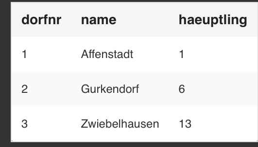
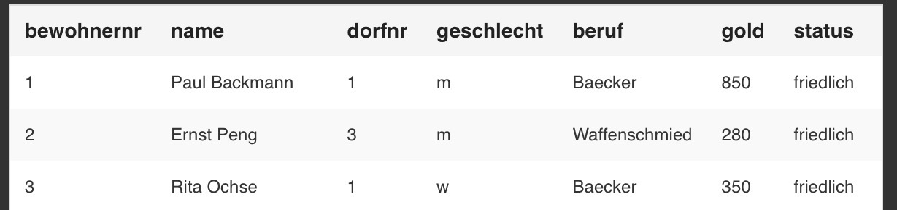

### SQL Befehle  
```sql
- SELECT
- *FROM*  = Auswahl von Tabellen  
- *WHERE* = Eingrenzen der Auszugebenen Zeilen  
- *GROUP BY*  = 
- *ORDER BY*  = Sortieren der Zeilen
- *ORDER BY DESC*  = Absteigende Sortierung 
- *ORDER BY ASC* = aufsteigende Sortierung 


LIKE = Vergleich Text mit Muster z.B. name LIKE 'Lu%'  
AND = Abfrage mit mehreren Bedingungen, z.B. name LIKE 'Lu%' AND status LIKE 'friedlich'  
OR = Ist das selbe wie bei UND nur das es oder ist  
COUNT = 
SUM = 
AVG = 
IS NULL = Abfrage ob ein Atribut keinen Wert hat 
IN = Abfrage, ob der Wert des Atributes in einer Liste vorkommt

---  

UPDATE = Ändert Daten   
DELETE = Löscht Daten


  


SELECT Dorf.dorfnr, Bewohner.bewohnernr FROM Dorf, Bewohner
WHERE Dorf.dorfnr = Bewohner.bewohenrnr
```

|Dorf.dorfnr|Bewohner.bewohnernr|  
|:---:|:---:|
|1|1|
|~~1~~|~~2~~|
|1|3|
|~~2~~|~~1~~|
|~~2~~|~~2~~|
|~~2~~|~~3~~|
|~~3~~|~~1~~|
|3|2|
|~~3~~|~~3~~|